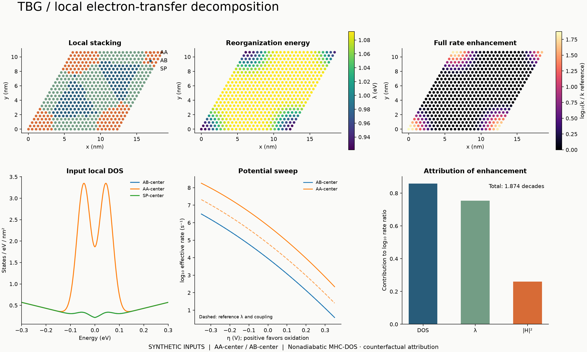

# Documentation

- [Methods and units](methods.md)
- [Import format](input-format.md)
- [Research plan and remaining calculations](research-plan.md)

The included demonstration is synthetic; see each input's provenance before interpreting a result.

